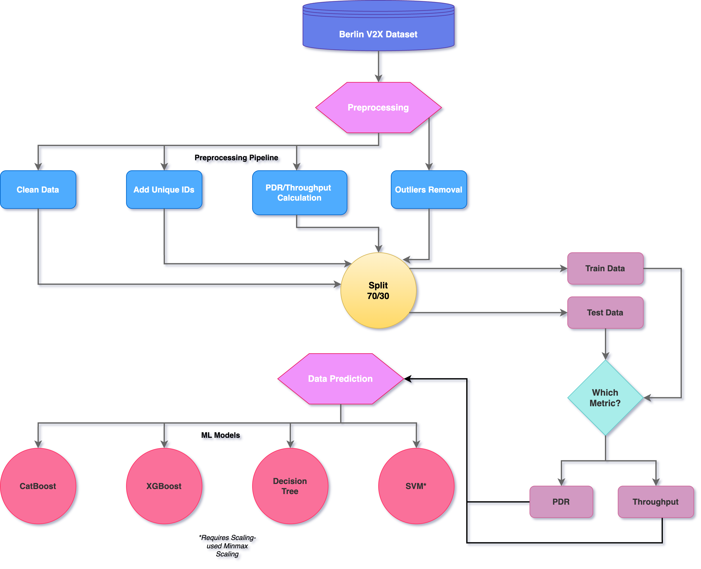

# 🚗 Seminar_pQoS_and_V2X
[English](#english-) | [Deutsch](#deutsch-)

# English 🇬🇧

## 📖 Project Description
This project explores predictive Quality of Service (pQoS) for Autonomous Systems, focusing on Vehicle-to-Everything (V2X) communication. The goal is to analyze and predict network performance to enhance the reliability and safety of autonomous vehicles.
## 📥 Dataset
To access the dataset, you need to download the Berlin dataset packages from [this link](https://ieee-dataport.org/open-access/berlin-v2x#). This dataset provides the necessary V2X communication data for analysis and model training.

## 🏗️ Architecture


## 📁 Project Structure

### `Preprocess_v2x.ipynb/`
Scripts for the initial processing of data, including data cleaning, implementing new features and creating V2X communication datasets for machine learning models.

### `pQoS_ML_PDR_and_*.ipynb/`
Machine learning model implementations for predictive QoS evaluation, focusing on PDR and Throughput metrics.

## 🛠️ Installation Instructions

1. **Clone the repository:**
    ```bash
    git clone https://github.com/Debanil1986/Seminar_pQoS_and_V2X.git
    cd TestQoS
    ```

2. **Create and activate a virtual environment:**
    ```bash
    python3 -m venv venv
    source venv/bin/activate
    ```

## 📦 Dependencies
- Python >= 3.10, < 3.13
- pandas, numpy, pycaret
- matplotlib, scikit-learn

# Deutsch 🇩🇪

## 📖 Projektbeschreibung
Dieses Projekt untersucht prädiktive Dienstqualität (pQoS) für autonome Systeme mit Fokus auf Vehicle-to-Everything (V2X) Kommunikation. Ziel ist es, die Netzwerkleistung zu analysieren und vorherzusagen, um die Zuverlässigkeit und Sicherheit autonomer Fahrzeuge zu verbessern.
## 📥 Datensatz
Um auf den Datensatz zuzugreifen, müssen Sie die Berliner Datensatzpakete von [diesem link](https://ieee-dataport.org/open-access/berlin-v2x#) herunterladen. Dieser Datensatz enthält die notwendigen V2X-Kommunikationsdaten für die Analyse und das Modelltraining.

## 🏗️ Architektur


## 📁 Projektstruktur

### `Preprocess_v2x.ipynb/`
Skripte zur Datenvorverarbeitung, einschließlich Datenbereinigung, Implementierung neuer Features und Erstellung von V2X-Kommunikationsdatensätzen für Machine-Learning-Modelle.

### `pQoS_ML_PDR_and_*.ipynb/`
Machine-Learning-Modellimplementierungen für prädiktive QoS-Auswertung, mit Fokus auf PDR- und Durchsatz-Metriken.

## 🛠️ Installationsanleitung

1. **Repository klonen:**
    ```bash
    git clone https://github.com/Debanil1986/Seminar_pQoS_and_V2X.git
    cd TestQoS
    ```

2. **Virtuelle Umgebung erstellen und aktivieren:**
    ```bash
    python3 -m venv venv
    source venv/bin/activate
    ```

## 📦 Abhängigkeiten
- Python >= 3.10, < 3.13
- pandas, numpy, pycaret
- matplotlib, scikit-learn

## 📜 Code of Conduct

We are committed to providing a welcoming and inclusive environment. All participants must:

- Be respectful and inclusive
- Exercise consideration in speech and actions
- Refrain from discriminatory behavior
- Report issues to project maintainers
- Follow professional standards

### 🚫 Unacceptable Behavior

- Harassment or discrimination
- Harmful language or imagery
- Personal or political attacks
- Public or private harassment
- Other unethical conduct

Violations may result in temporary or permanent restrictions.

## 📜 Verhaltenskodex

Wir setzen uns für eine einladende und integrative Umgebung ein. Alle Teilnehmer müssen:

- Respektvoll und inklusiv sein
- Rücksichtsvoll in Wort und Tat sein
- Diskriminierendes Verhalten unterlassen
- Probleme an Projektbetreuer melden
- Professionelle Standards einhalten

### 🚫 Inakzeptables Verhalten

- Belästigung oder Diskriminierung
- Verletzende Sprache oder Bilder
- Persönliche oder politische Angriffe
- Öffentliche oder private Belästigung
- Anderes unethisches Verhalten


## 📚 Detailed Code of Conduct

For our complete Code of Conduct, please see [CODE_OF_CONDUCT.md](CODE_OF_CONDUCT.md)

## 📚 Ausführlicher Verhaltenskodex

Für unseren vollständigen Verhaltenskodex, siehe [CODE_OF_CONDUCT.md](CODE_OF_CONDUCT.md)


